# Milestone Project 4 Fullstack Frameworks with Django - The Brilliant Greens E-commerce Shop
<p align="center">

</p>

## Problem Statement
The aim of this project is to demonstrate ones ability to utilize python web framework, Flask, to perform create, read, update and delete (CRUD) operation with a database. 
To fulfill this requirement in a practical approach, an application which allows user to share movie information such as casts, director, images or short clips,
 was built. This
application shall be able to perform the following:
- To add a new movie
- To edit a movie info
- To delete a movie
- To search for a movie by filtering
<br/>

## Frontend

### UX
Realization of this project depends on the availability of users and technologies. Users would be moviegoers or moive reviewers who wants to share 
different types of movie they have watched. This application should fulfill their following needs:

- "I want to have different ways to filter for a particular movie information."
- "I want to know what type of movie which I have just watched."
- "I want to share and add this old movie info to somewhere for others to know."
- "I want to edit and delete movie info which is wrong."
- "I want to know which movies this particular actor/director is casted in."

By using front-end and back-end technologies such as bootstrap, flask, the user's needs can be achieved.<br/>

The minimalist design approach on the styling of the appliation is to allow the content to stand out and be the focal point. Each buttons are designed and styled 
in a similar fashion to allow ease of recognizing interactive features on the application. 
As filtering by genre is a common queries ones will seek before 
reading further about a movie, this application would present a landing page showing different movies filtered by genre. For ease of access to filter movies by year
or genre or keywords and adding movie info, the top bar would be built with these features and available in every pages.

<p align="center">

<br/>Fig-1 Landing page of MovieFinder
</p>

A wireframe of this application can be found [here](https://xd.adobe.com/view/c864c35f-f438-4c5f-9042-366ff94d3027-9d37/).<br/>

### Features
#### Existing Features

- ***Landing Page*** - The landing page displays movies filtered by different genre.
<p align="center">

</p>

- ***Movie Info Search Bar*** - This feature allow user to search for different number of movies in the movie database by keywords. This feature
is currently limited to English language only.
 <br/><p align="center">

</p>
<br/>


- ***Top Bar Buttons*** - (From left to right) The "i" movie recorder button directs the user back to the landing page. 
The genre dropdown menu displays a range of available genre and if selected, it directs the user to the movie info list of the selected genre.
The year dropdown menu displays a range of available year and if selected, it directs the user to the movie info list of the selected year. The add movie
button displays the add new movie popout.
 <br/><p align="center"><p align="center"></p>
  <br/>

- ***Movie Genre View More Button*** - The view more button directs the user to a movie info list page filtered by genre .
<br/><p align="center"></p>
  <br/>  


- ***Movie Info Page Side Bar Button*** - (From top to bottom) The waste bin icon directs the user to the delete popout. The edit icon directs the user to the update popout.
<br/><p align="center"></p>
  <br/>

 - ***Movie Info List*** - The movie info list displays a list of filtered movies.
<br/><p align="center"></p>
  <br/>

- ***Movie Info Page*** - The movie info page displays information of a selected movie.
<br/><p align="center">
</p>
  <br/>

- ***Add New Movie Popout*** - The add new movie popout allows user to add a new movie information into the database. It includes a backend validation feature to prevent invalid
info to be uploaded into the database. Partial of the validation script is as shown below:
<br/><p align="center">
</p>
  <br/>

  ```
            # To check whether field is empty
        if len(imageurl.filename) == 0:
            errors['file_is_blank'] = "Poster field cannot be blank"
        elif '.' in imageurl.filename:
            file_ext = os.path.splitext(imageurl.filename)[1]
            # To validate file extension
            if file_ext.lower() not in app.config['UPLOAD_EXTENSIONS']:
                errors['poster_ext_is_wrong'] = "Poster file ext is invalid"
            # To validate file size
            elif poster_size > 1024 * 1024:
                errors['poster_size_above_limit'] = "Poster file size cannot be  more than 1MB"

        # To check whether field is empty
        if len(backdrop.filename) == 0:
            errors['backdrop_is_blank'] = "Backdrop field cannot be blank"
        elif '.' in backdrop.filename:
            file_ext = os.path.splitext(backdrop.filename)[1]
            # To validate file extension
            if file_ext.lower() not in app.config['UPLOAD_EXTENSIONS']:
                errors['bkdrp_ext_is_wrong'] = "Backdrop file ext is invalid"
            # To validate file size
            elif backdrop_size > 1024 * 1024:
                errors['backdrop_size_above_limit'] = "Backdrop file size cannot be more than 1MB"
  ```

- ***Update Movie Popout*** - The update movie popout allows user to edit a movie information and upload into the database. Same as the add new movie feature, it also includes a backend validation 
feature to prevent invalid
info to be uploaded into the database.
<br/><p align="center"> </p>
  <br/>

- ***Delete Movie Popout*** - The delete movie popout allowes user to delete movie info from the database. 
<br/><p align="center"></p>
  <br/>

- ***Custom 404 Error Page*** - The custom 404 error page directs the user to a customized 404 error page. The user can be redirected back to the landing page by 
clicking onto the 'i' movie recorder button on the top bar.
<br/><p align="center">
</p>
  <br/>


a.	password changed successfully can be shown using flash msg
b.	Add pagination for product page, orders page, shop page
c.	add filtering feature - BL
d.	display the latest for the orders and the comments


  
  
### Feature Left to Implement
- ***Showing Password Changed Successfully in Flash Message***<br/>
This feature will allow user to create an account and thus, also provide a database of user for this application.<br/><br/> 
- ***Pagnation Pages***<br/>
This feature will allow user to provide their comments for a particular movie and whether they like the movie.  <br/><br/>
- ***Filtering Features***<br/>
This feature will allow user to rate a movie.
<br/><br/>
- ***Multi Languages Supports***<br/>
This feature will allow user to search for different movie info in different langauges.
<br/><br/>


## Backend
The backend structure of this application is built upon Django's app structures, 
project structure and Model Template View (MTV) framework. The following explains further on each of this commponent:

### Apps
To build the fundamental functions, such as products, carts, for an e-commerce, 
the following apps are created as such:  

- product app - to manage all the product related logic or templates
- review app - to manage all product reviews related logic or templates
- checkout app - to manage on all the payment and order related logic or templates
- cart app - to manage on all cart related logic or templates
- users app - to manage on all user information related logic or templates
### Views
The views created for handling the logic for each app are as follow:

- product views
    - index - to render the landing page
    - about_us - to render the about us page
    - shop_page - to handle backend logic, render the query page and shop page
    - product_page - to handle the backend logic for reviews and rating calculation and render the product page
- review views
    - write_review - to render the user review page
    - create_review - to handle the backend logic to create and save the reviews
- checkout views
    - checkout - to handle the backend logic with stripe payment
    - order_completed - to render the completed payment page
    - order_not_completed - to render the uncompleted payment page
    - payment_completed - to handle the backend logic after stripe payment is completed
- cart views
    - add_to_cart - to handle the backend logic to add an item to cart
    - remove_from_cart - to handle the backend logic to remove an item from cart
    - update_cart - to handle the backend logic to udpate the cart
    - view_cart - to handle the backend logic on calculating the total price in cart and render the view cart page 
- users views
    - user_account - to handle the backend logic related to user account and render the user page
 

### Templates
The html templates created for handling each app are as follow:

- product templates
    - about_us - to show the about us page
    - shop_page - to show the about shop page
    - product_page - to show the product page
    - landing_page - to show the landing page
    - no_result -
- review templates
    - user_review - to show the user review page
- checkout templates
    - checkout - to show the stripe payment page
    - order_completed - to show the completed payment page
    - order_not_completed - to show the uncompleted payment page
- cart templates
    - view_cart - to show the view cart page
- users templates
    - user_info - to the user account page
- allauth templates - to show the responses for all login/sign-up related pages

### Model
The models created for handling each app are as follow:
- product model - Independent entity that contains the following attributes:
    - name, species, size, description, rating, reviews, qty, watering, level, country, image, price
- review model - Dependent entity that contains the following attributes:
    - title, contents, date, plant(foreignkey), reviewed_by(foreignkey), rating, order(foreignkey)
- checkout_order model - Dependent entity that contains the following attributes:
    - title, price, datetime_ordered, plant(foreignkey), order_by(foreignkey), qty
- cart model - not applicable as the line items in cart are stored in session
- users_userinfo - Dependent entity that contains the following attributes and validation rule:
    - user(foreignkey), date_of_birth
    - age_check - to raise a validation error if received date data is in the future or below 6 years old

### Schema
The relationship between the entities as shown in the schema below can be described as follow:
- An order can have 1 review or many reviews
- A user can make 1 order or many orders
- A plant can be bought by 1 order or many orders
- A user can make 1 review or many reviews
<br/>


## Technologies Used

- [HTML/CSS](https://html.com/)<br/>
The project uses HTML/CSS for base template and styling of the landing page.
- [Python](https://www.python.org/)<br/>
The project uses Python as the primary programming language.
- [Bootstrap](https://getbootstrap.com/)<br/>
The project uses Bootstrap for the application responsiveness for different screen sizes.
- [Inkscape](https://inkscape.org/)<br/>
The project uses inkscape for creating svg files.
- [JQuery](https://jquery.com/)<br/>
The project uses JQuery to ease the manipulation of DOM. 
- [Heroku](https://www.heroku.com/)<br/>
The project uses Heroku to host the application. 
- [Django](https://flask.palletsprojects.com/en/1.1.x/)<br/>
The project uses Flask as the backend frame for server side scripting.
- [PostgreSQL](https://www.postgresql.org/)<br/>
The project uses PostgreSQL DB as database.<br/>
- [Uploadcare](https://cloudinary.com/)<br/>
The project uses Upload to store image files and provides the image url links. 
<br/><br/>

## Testing

The testings for this application are categorized as per the following:

- UX Testing – To test the user experiences when using the website
- Login/ Sign-up Testing – To test the login and sign up features of the website
- User Account Testing – To test the user account features after logged into the website
- Admin Testing – To test the admin features using Django administration tool.
- Payment Testing – To test the payment features when user click the checkout button
- Security Testing – To test the security features for the website

There are in total 47 test cases performed and the test report can be accessed [here](https://tomato-constrictor-k5cksavp.ws-us04.gitpod.io/files/download/?id=14157348-0fb3-4cd1-b2b1-0628628fb33a).<br/>

## Responsiveness
**360 x 640 (Moto G4)**<br><p align="center">
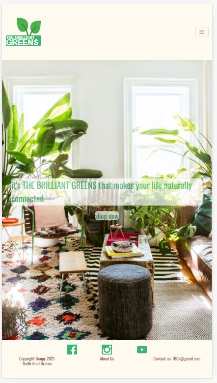
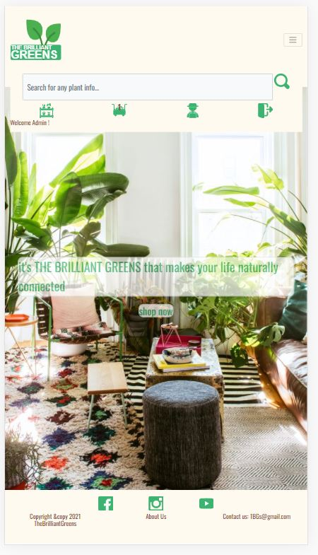
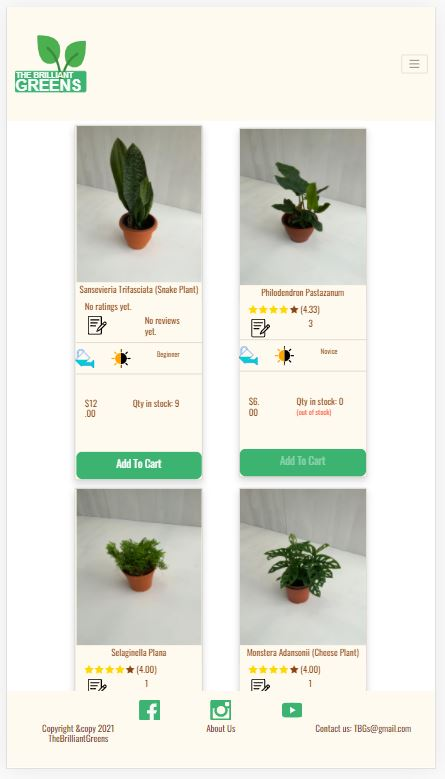
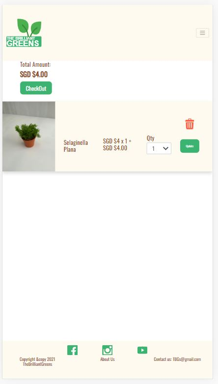
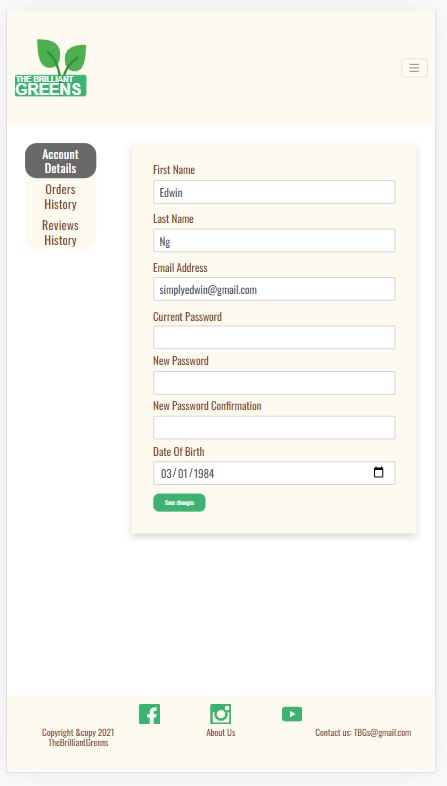</p>


<br>

**414 x 736 (iPhone 6/7/8 Plus)**<br><p align="center">
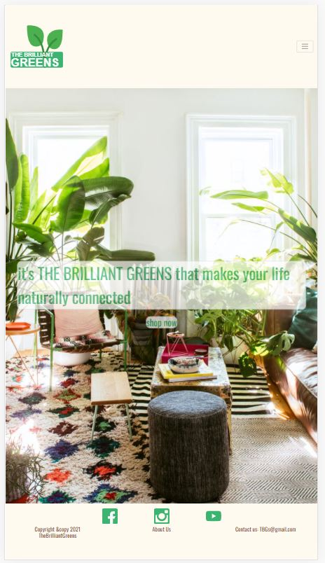
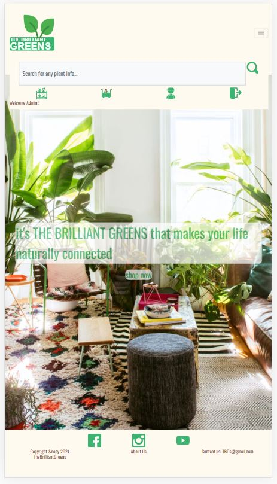
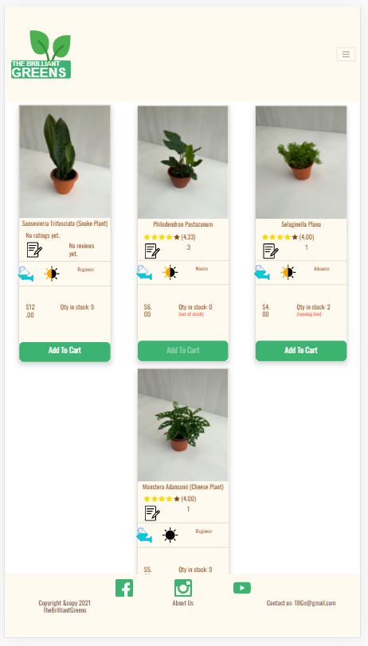
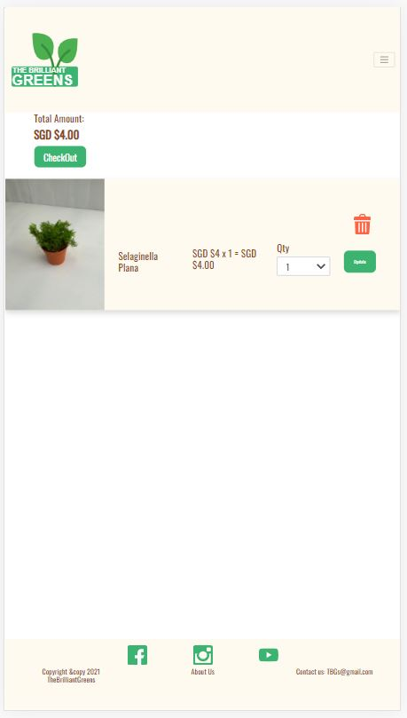
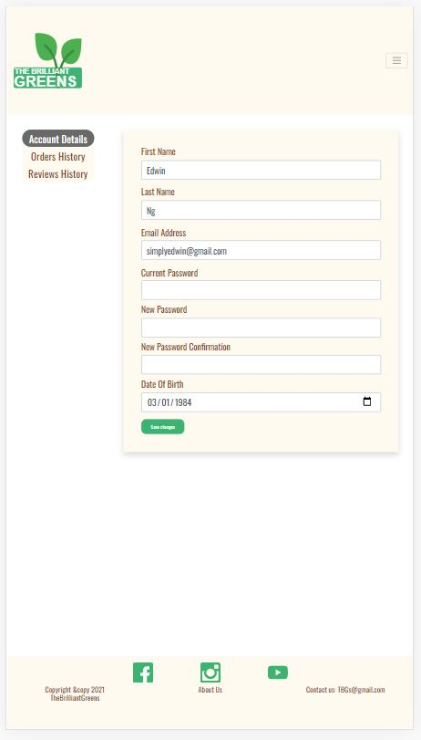</p>

<br>


**768 x 1024 (iPad)**<br><p align="center">
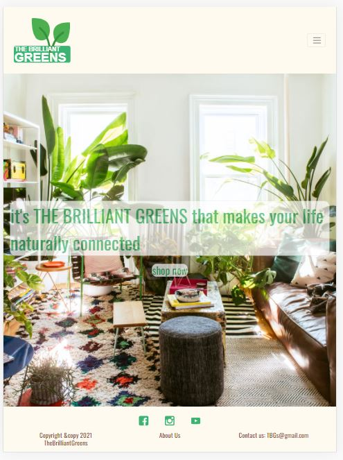
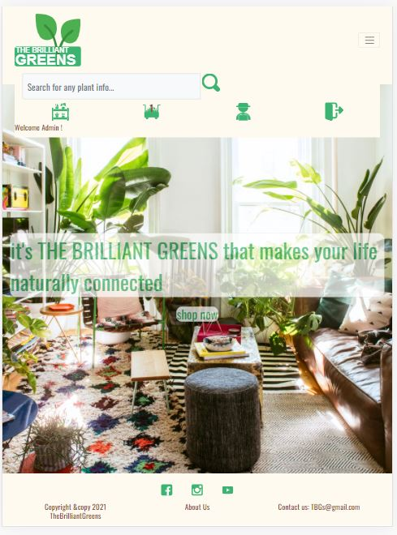

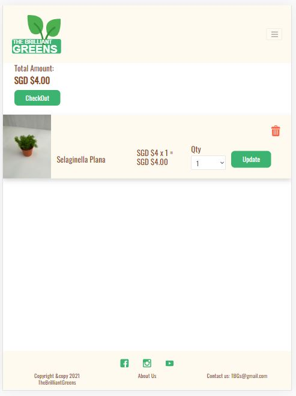
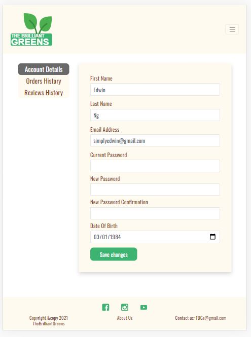</p>

<br>

### Bugs/Problems Encountered
There are a numbers of bugs or problems encountered during the development of the project. The main ones are as explained below:

- ***Form is not valid post back*** <br>
Intially, whenever an invalid form is posted back to the url, there is no means to verify the invalid causes. It was later found 
out from the django form api that it exists an form.errors api to retrieve the problematic form fields. Subsequently, all form invalid
was easily resolved.

- ***Render model for all template*** <br>
To enhance the user experiences when adding an item into the cart, the cart icon on the navigation bar changed to a filled up icon and 
shows the number of items in the cart. As the cart icon resides in the base template, each template needs to retrieve the cart session information
in order to pass to the base template to render the information. However, as the "login/sign-up" page uses the existing default template, it would
takes some efforts to customize the views for these template in order to retreive and pass the cart session information. Fortuanately, there is a
feature in Django that allows one to pass the model information at global level to all templates and this feature is known as context processor. Hence, 
a context processor module for the cart session was created and solved the problem. The below is an extract of the code:

```
            # this context processor is needed to pass the information of the cart
            # to the base-template.html to render when the user is in the login/signup page

            def cartinfo(request):

                # to determine the qty of items in cart
                cart = request.session.get('shopping_cart', {})

                return {'cart': cart}

```

- ***Status Code 302 response from Stripe Webhook*** <br>
During processing the payment by stripe with webhook enabled, the stripe webhook keeps responding back with a status code 302 even though
payment_completed function was exempted from CSRF. It was found out the "login_required" decorator was added on the payment_completed function
which caused the problem. It was resolved by removing the decorator.


- ***Not scrollable body*** <br>
During the development of the page content, some information of the page cannot be seen even though the page is scrollable. It was later found out that
the height of these pages exceeded the viewing height of the body. This was resolved by dividing the pages into 3 section with different styling
as shown in the below CSS codes. This makes the mainsection of the page to be scrollable and hence, increased the viewing height of the page.   

```
                .navbar {
                    height: 15vh;
                    background-color: #fffaf0;
                }

                .mainsection {
                    flex: 1 0 auto;
                    overflow: auto;
                    position: absolute;
                    top: 15vh;
                    bottom: 10vh;
                }


                .footer {
                    position: absolute;
                    height: 10vh;
                    left: 0;
                    bottom: 0;
                    width: 100%;
                    background-color: #fffaf0;
                    text-align: center;
                }

```

## Deployment

The website is hosted using heroku and can be accessed via 
[here](https://simplyedwin-tgc-proj4.herokuapp.com/).


## Credits

### Media

- The links for the youtube, facebook and instgram used are from the Code Institute corresponding social media platforms.


### Acknowledgements

- Trent colleage staff and classmates for feedbacks on website design

- Design of logo are sourced from [Freepik](https://www.flaticon.com/authors/freepik).

- [Toast scripts](https://github.com/CodeSeven/toastr) used for flashing message.

- Readme template from [Code Institute](https://github.com/Code-Institute-Solutions/readme-template).

- Model Template View from [Overiq](https://overiq.com/django-1-10/mvc-pattern-and-django/#:~:text=Django%20follows%20MVC%20pattern%20very,and%20controllers%20are%20called%20views.)

- Dependent and Independent Entities from [amazonaws](https://s3.amazonaws.com/erwin-us/Support/95/CA+ERwin+Data+Modeler+r9+5-ENU/Bookshelf_Files/HTML/ERwin%20Overview/index.htm?toc.htm?254581.html)