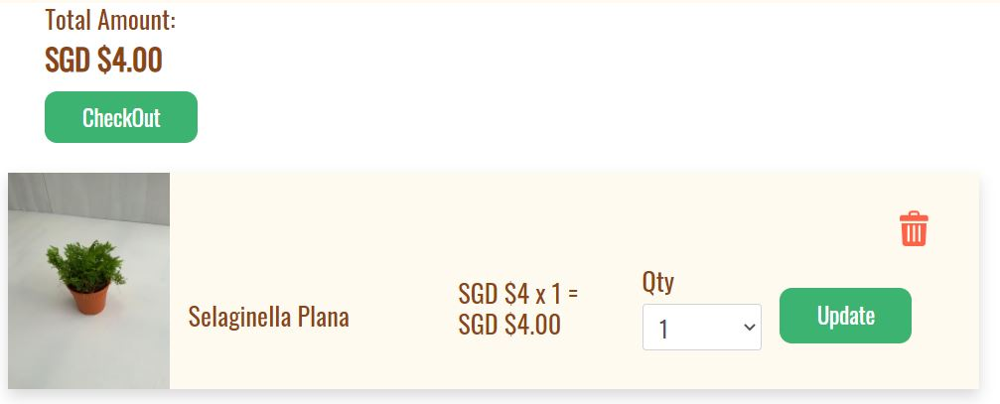
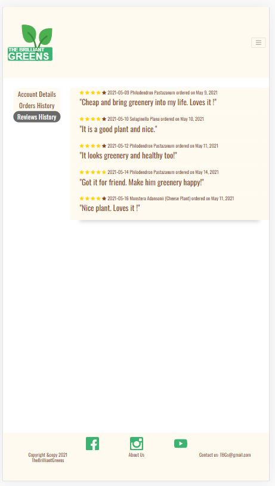
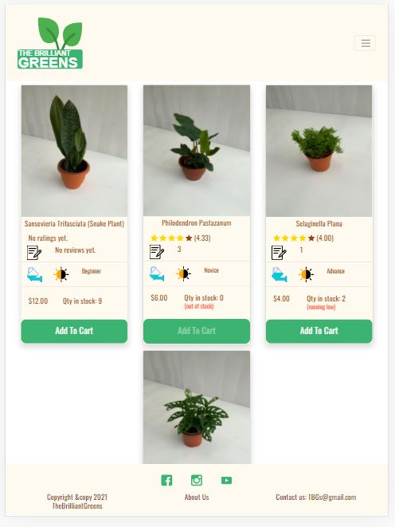

# Milestone Project 4 Fullstack Frameworks with Django - The Brilliant Greens E-commerce Shop
<p align="center">

</p>

## Problem Statement
The aim of this project is to demonstrate ones ability to develop a full stack application with django web framework and create, read, update and delete (CRUD) operation with a database. 
To fulfill this requirement in a practical approach, an application which allows user to login or sign up and perform payment was built. This
application shall be able to perform the following:
- To login or sign up an account
- To handle user related information
- To add items to a cart
- To remove items from a cart
- To write review and provide rating for purchased items 
- To make payment
- To search for information of a product
<br/>

## Frontend

### UX
Realization of this project depends on the availability of users and technologies. Users would be indoor plant enthusiast or someone who is looking to "greenify" their 
home due to prolong working from home. This application should fulfill their following needs:

- "I want my room to be more greenery."
- "I want to purchase some plants from an e-commerce shop."
- "I want to know that there are stocks available for the plant that I want to purchase."
- "I want to be able to type and search some information of plants."
- "I want to be able to see maintenance information about some plants."
- "I want to be able to log in to an plant e-commerce shop."
- "I want to be able to sign up an account with an plant e-commerce shop."
- "I want to be able to see the items added to my cart."
- "I want to be able to remove items from my cart."
- "I want to be able to reset my password if I have forgotten it."
- "How many plants can I add to the cart?"
- "How do I know I that I have logged in to the plant e-commerce shop?"
- "How do I know that I have logged out from the plant e-commerce shop?"
- "How do I know that there are errors for the information that I have provided?"

By using front-end and back-end technologies such as bootstrap, django, the user's needs can be achieved.<br/>

The minimalist design approach on the styling of the appliation is to allow the content to stand out and be the focal point. The choice of color used brings in a feel of nature 
to a user visiting the e-commerce shop. Each buttons are designed and styled in a similar fashion to allow ease of recognizing interactive features on the application. To provide
as much information as possible for each plant, meaningful and easy to understand icons are used to show on the shop page (See Fig-2).  

<p align="center">

<br/>Fig-1 Landing page of The Brilliant Greens E-commerce Shop
</p>
<br/>
<p align="center">

<br/>Fig-2 A plant information showing maintenance information, reviews and ratings icons in the shop page
</p>

A wireframe of this application can be found [here](https://xd.adobe.com/view/c864c35f-f438-4c5f-9042-366ff94d3027-9d37/).<br/>

### Features
#### Existing Features

- ***Navigation Bar Icons*** - The navigation bar features are as follow:
    1) Brand Icon - to display the landing page
    2) Search Bar - to allow user to search for plant information by providing some input
    3) Magnifying Glass Icon - to run and display the queried result
    4) Shop Icon - to display the overall shop page
    5) Cart Icon - to display the cart page
    6) Account Icon - to display the user acccount information page 
    7) Logout Icon - to logout 
    8) User Logged In Status - to display the current logged in user's username

<p align="center">

</p>

- ***Footer Icons*** - The footer features are as follow:
    1) Facebook Icon - to open a new browser tab to the Code Institute Facebook page
    2) About Us Link - to display the "about-us" page
    3) Instgram Icon - to open a new browser tab to the Code Institute Instgram page
    4) Youtuube Icon - to open a new browser tab to the Code Institute Youtube page
 <br/>
 
 <p align="center">

</p>
<br/>

- ***Cart Icons*** - The figures below show 2 type of cart icon. The left is displayed when no item is added into the cart while the right is displayed when items are added into the cart.
 <br/>
 <p align="center">


</p>

- ***Shop Now Linkr*** - The below figure shows the shop now link which will redirect the user to the shop page. 
 <br/>
 <p align="center">

</p>

<br/>

- ***Account Icon Dropdown*** - The figure below shows the dropdown menu which will appear when hover over the account icon.
 <br/>
 <p align="center">

</p>
<br/>

- ***Empty Cart Page*** - The figure show the empty cart page which will appear when no item is added to the cart.  
 <br/>
 <p align="center">

</p><br/>

 - ***Filled Cart Page*** - The figure below shows the cart page which an item will appear in the cart page when the item is added to the cart.
<br/>
 <p align="center">

</p>
<br/>


- ***Login Page*** - The figure below shows the login page for user to log in to his/her account.
 <br/>
 <p align="center">

</p>
<br/>

- ***Sign Out Page*** - The figure below shows the sign out pop out modal for user to sign out.
 <br/>
 <p align="center">

</p>
<br/>

- ***Password Reset Page*** - The figure below shows the password reset page for user to request for password reset. 
 <br/>
 <p align="center">

</p>
<br/>

- ***Sign Up Page*** - The figure below shows the sign up page which allows user to create a new account.
 <br/>
 <p align="center">

</p>
<br/>

- ***Product Page with disable "Add To Cart" Button*** - The figure below shows the standard product page and also a disabled "Add To Cart" button when the plant is out of stock. 
 <br/>
 <p align="center">

</p>
<br/>

- ***Shop Page with Warning Messages*** - The figure below shows the standard shop page. It also shows the warning features when the stock is running low or user's order limits 
as well as a disabled "Add To Cart" button when the plant is out of stock.
 <br/>
 <p align="center">

</p>
<br/>

- ***Account Detail Page*** - The figures below show the account detail pages for user to update his or her information. The right figure shows the error message when a user provides
a date in future for his or her birthday information.
 <br/>
 <p align="center">


</p>
<br/>

- ***Orders History Page*** - The figure below shows the account detail page for user to view his or her orders history, as well as to write review. 
 <br/>
 <p align="center">

</p>
<br/>

- ***Reviews History Page*** - The figure below shows the account detail page for user to view his or reviews history. 
 <br/>
 <p align="center">

</p>
<br/>

- ***Custom 404 Error Page*** - The figure below shows the custom 404 error page which directs the user to a customized 404 error page. The user can be redirected back to the landing page by 
clicking onto the brand icon.
<br/>
<p align="center">
</p>
  <br/>


### Feature Left to Implement
- ***Showing Password Changed Successfully in Flash Message***<br/>
This feature will show the password is changed successfully using flash message instead of directing to a page.<br/><br/> 

- ***Pagnation Pages in Reviews or Orders History Page***<br/>
This feature will limit the number of reviews or orders show in a page to enhance the user experiences.  <br/><br/>

- ***Filtering Features in Reviews or Orders History Page***<br/>
This feature will allow user to filter by the latest reviews or orders, as well as to filter to show orders that are yet to be reviewed.
<br/><br/> 

- ***Multi Languages Supports***<br/>
This feature will allow user to access the application in different langauges.
<br/><br/>


## Backend
The backend structure of this application is built upon Django's app structures, 
project structure and Model Template View (MTV) framework. The following explains further on each of this commponent:

### Apps
To build the fundamental functions, such as products, carts, for an e-commerce, 
the following apps are created as such:  

- product app - to manage all the product related logic or templates
- review app - to manage all product reviews related logic or templates
- checkout app - to manage on all the payment and order related logic or templates
- cart app - to manage on all cart related logic or templates
- users app - to manage on all user information related logic or templates
### Views
The views created for handling the logic for each app are as follow:

- product views
    - index - to render the landing page
    - about_us - to render the about us page
    - shop_page - to handle backend logic, render the query page and shop page
    - product_page - to handle the backend logic for reviews and rating calculation and render the product page
- review views
    - write_review - to render the user review page
    - create_review - to handle the backend logic to create and save the reviews
- checkout views
    - checkout - to handle the backend logic with stripe payment
    - order_completed - to render the completed payment page
    - order_not_completed - to render the uncompleted payment page
    - payment_completed - to handle the backend logic after stripe payment is completed
- cart views
    - add_to_cart - to handle the backend logic to add an item to cart
    - remove_from_cart - to handle the backend logic to remove an item from cart
    - update_cart - to handle the backend logic to udpate the cart
    - view_cart - to handle the backend logic on calculating the total price in cart and render the view cart page 
- users views
    - user_account - to handle the backend logic related to user account and render the user page
 

### Templates
The html templates created for handling each app are as follow:

- product templates
    - about_us - to show the about us page
    - shop_page - to show the about shop page
    - product_page - to show the product page
    - landing_page - to show the landing page
    - no_result -
- review templates
    - user_review - to show the user review page
- checkout templates
    - checkout - to show the stripe payment page
    - order_completed - to show the completed payment page
    - order_not_completed - to show the uncompleted payment page
- cart templates
    - view_cart - to show the view cart page
- users templates
    - user_info - to the user account page
- allauth templates - to show the responses for all login/sign-up related pages

### Model
The models created for handling each app are as follow:
- product model - Independent entity that contains the following attributes:
    - name, species, size, description, rating, reviews, qty, watering, level, country, image, price
- review model - Dependent entity that contains the following attributes:
    - title, contents, date, plant(foreignkey), reviewed_by(foreignkey), rating, order(foreignkey)
- checkout_order model - Dependent entity that contains the following attributes:
    - title, price, datetime_ordered, plant(foreignkey), order_by(foreignkey), qty
- cart model - not applicable as the line items in cart are stored in session
- users_userinfo - Dependent entity that contains the following attributes and validation rule:
    - user(foreignkey), date_of_birth
    - age_check - to raise a validation error if received date data is in the future or below 6 years old

### Schema
The relationship between the entities as shown in the schema below can be described as follow:
- An order can have 1 review or many reviews
- A user can make 1 order or many orders
- A plant can be bought by 1 order or many orders
- A user can make 1 review or many reviews
<br/>

<p align="center">

  <br/>

## Technologies Used

- [HTML/CSS](https://html.com/)<br/>
The project uses HTML/CSS for base template and styling of the landing page.
- [Python](https://www.python.org/)<br/>
The project uses Python as the primary programming language.
- [Bootstrap](https://getbootstrap.com/)<br/>
The project uses Bootstrap for the application responsiveness for different screen sizes.
- [Inkscape](https://inkscape.org/)<br/>
The project uses Inkscape for creating svg files.
- [JQuery](https://jquery.com/)<br/>
The project uses JQuery to ease the manipulation of DOM. 
- [Heroku](https://www.heroku.com/)<br/>
The project uses Heroku to host the application. 
- [Django](https://www.djangoproject.com/)<br/>
The project uses Django as the web framework for server side scripting.
- [PostgreSQL](https://www.postgresql.org/)<br/>
The project uses PostgreSQL DB as database.<br/>
- [Uploadcare](https://uploadcare.com/)<br/>
The project uses Upload to store image files and provides the image url links. 
- [Stripe](https://stripe.com/en-sg)<br/>
The project uses Stripe for online payment testing. 
<br/>

## Testing

The testings for this application are categorized as per the following:

- UX Testing – To test the user experiences when using the website
- Login/ Sign-up Testing – To test the login and sign up features of the website
- User Account Testing – To test the user account features after logged into the website
- Admin Testing – To test the admin features using Django administration tool.
- Payment Testing – To test the payment features when user click the checkout button
- Security Testing – To test the security features for the website

There are in total 47 test cases performed and the test report can be accessed [here](https://tomato-constrictor-k5cksavp.ws-us04.gitpod.io/files/download/?id=14157348-0fb3-4cd1-b2b1-0628628fb33a).<br/>

## Responsiveness
**360 x 640 (Moto G4)**<br><p align="center">


</p>
<br>

**414 x 736 (iPhone 6/7/8 Plus)**<br><p align="center">




</p>
<br>

**768 x 1024 (iPad)**<br><p align="center">





</p>
<br>

### Bugs/Problems Encountered
There are a numbers of bugs or problems encountered during the development of the project. The main ones are as explained below:

- ***Form is not valid post back*** <br>
Intially, whenever an invalid form is posted back to the url, there is no means to verify the invalid causes. It was later found 
out from the django form api that it exists an form.errors api to retrieve the problematic form fields. Subsequently, all form invalid
was easily resolved.

- ***Render model for all template*** <br>
To enhance the user experiences when adding an item into the cart, the cart icon on the navigation bar changed to a filled up icon and 
shows the number of items in the cart. As the cart icon resides in the base template, each template needs to retrieve the cart session information
in order to pass to the base template to render the information. However, as the "login/sign-up" page uses the existing default template, it would
takes some efforts to customize the views for these template in order to retreive and pass the cart session information. Fortuanately, there is a
feature in Django that allows one to pass the model information at global level to all templates and this feature is known as context processor. Hence, 
a context processor module for the cart session was created and solved the problem. The below is an extract of the code:

```
            # this context processor is needed to pass the information of the cart
            # to the base-template.html to render when the user is in the login/signup page

            def cartinfo(request):

                # to determine the qty of items in cart
                cart = request.session.get('shopping_cart', {})

                return {'cart': cart}

```

- ***Status Code 302 response from Stripe Webhook*** <br>
During processing the payment by stripe with webhook enabled, the stripe webhook keeps responding back with a status code 302 even though
payment_completed function was exempted from CSRF. It was found out the "login_required" decorator was added on the payment_completed function
which caused the problem. It was resolved by removing the decorator.


- ***Not scrollable body*** <br>
During the development of the page content, some information of the page cannot be seen even though the page is scrollable. It was later found out that
the height of these pages exceeded the viewing height of the body. This was resolved by dividing the pages into 3 section with different styling
as shown in the below CSS codes. This makes the mainsection of the page to be scrollable and hence, increased the viewing height of the page.   

```
                .navbar {
                    height: 15vh;
                    background-color: #fffaf0;
                }

                .mainsection {
                    flex: 1 0 auto;
                    overflow: auto;
                    position: absolute;
                    top: 15vh;
                    bottom: 10vh;
                }


                .footer {
                    position: absolute;
                    height: 10vh;
                    left: 0;
                    bottom: 0;
                    width: 100%;
                    background-color: #fffaf0;
                    text-align: center;
                }

```

## Deployment

The website is hosted using heroku and can be accessed via 
[here](https://simplyedwin-tgc-proj4.herokuapp.com/).

The test credential is as follow:
-   Username: tgcproj4tbgs
-   Password: testtbgs1


## Credits

### Media
The media used in the application are from the below source:
- The links for the youtube, facebook and instgram icons used are from the Code Institute corresponding social media platforms.
- [Landing page photo](https://betterhousekeeper.com/2020/02/25/effective-ways-to-spruce-up-your-home-with-the-help-of-plants/)

### Acknowledgements

- Trent colleage staff and classmates for feedbacks on website design.

- Design of icons and logo are sourced from [Freepik](https://www.flaticon.com/authors/freepik).

- [Toast scripts](https://github.com/CodeSeven/toastr) used for flashing message.

- Readme template from [Code Institute](https://github.com/Code-Institute-Solutions/readme-template).

- Model Template View from [Overiq](https://overiq.com/django-1-10/mvc-pattern-and-django/#:~:text=Django%20follows%20MVC%20pattern%20very,and%20controllers%20are%20called%20views.).

- Dependent and Independent Entities from [amazonaws](https://s3.amazonaws.com/erwin-us/Support/95/CA+ERwin+Data+Modeler+r9+5-ENU/Bookshelf_Files/HTML/ERwin%20Overview/index.htm?toc.htm?254581.html).

- [DBeaver ERD](https://dbeaver.com/docs/wiki/ER-Diagrams/) explanation and standard [references](https://en.wikipedia.org/wiki/IDEF1X).

- Plant Information
    - [Philodendron](https://gardeningbrain.com/pastazanum/)
    - [Cheesy Plant](https://www.gardensbythebay.com.sg/en/stayhomewithgb/articles-infographics/bringing-the-gardens-home/swiss-cheese.html)
    - [Snake Plant](https://www.sublimesucculents.com/8-types-snake-plant/)
    - [Selaginella-plana](https://jaycjayc.com/selaginella-plana-cyperus-clubmoss/#.YIgxtrUzaUk)

- Codes reference for the [star rating](https://www.w3schools.com/howto/howto_css_star_rating.asp).

- CSS styling for the navbar [hover effects](https://css-tricks.com/change-color-of-svg-on-hover/).

- Code references for the [dropdown menu](https://www.w3schools.com/howto/howto_css_dropdown.asp) when hover over the action icon.

- References for the [context processor](https://dev.to/gilbishkosma/custom-context-processors-in-django-3c93) on the cart session.